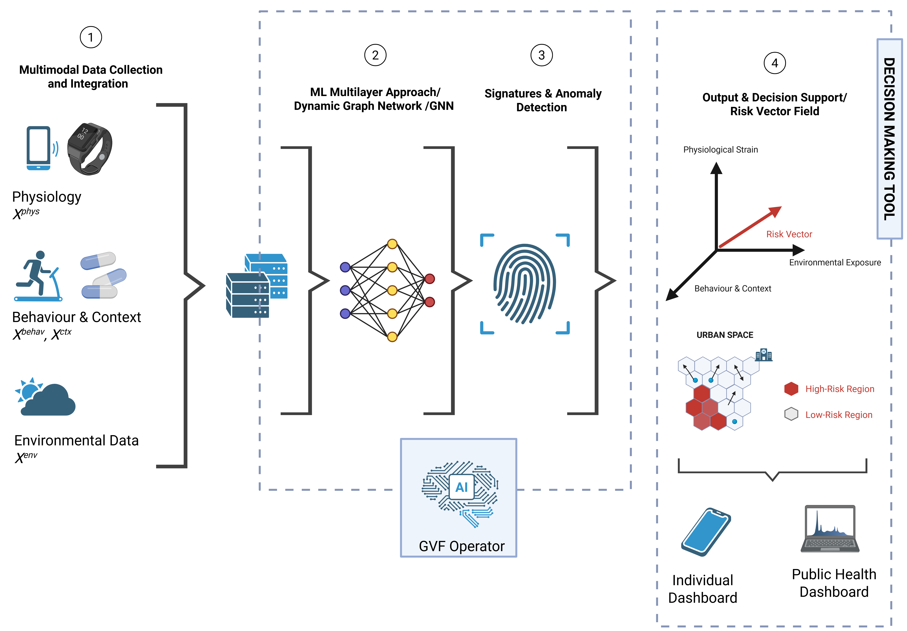

# Graph Vector Fields: A New Framework for Personalised Risk Assessment

This repository contains the official source code and experiments for the paper **"Graph Vector Fields: A New Framework for Personalised Risk Assessment"** by Silvano Coletti and Francesca Fallucchi.

We introduce **Graph Vector Fields (GVFs)**, a novel framework that moves beyond traditional scalar scores to represent health risk as a dynamic, interpretable vector field on a graph. This work provides a robust proof-of-concept, demonstrating the framework's superiority in modeling complex, heterogeneous, and relational health data compared to standard approaches.

## Framework Architecture

The core of the GVF framework is a **Mixture-of-Experts (MoE) operator** that processes multimodal data through specialized experts. This architecture allows the model to learn and represent different facets of risk, such as environmental, behavioral, and contagious risks, within a unified vector space.


*Figure 1: Conceptual architecture of the GVF framework.*

---

## Getting Started

Follow these instructions to set up the environment and reproduce the results presented in the paper.

### Prerequisites

* Python 3.10+
* PyTorch
* Git

### Installation

1.  **Clone the repository:**
    ```sh
    git clone [https://github.com/your_username/graph-vector-fields.git](https://github.com/your_username/graph-vector-fields.git)
    cd graph-vector-fields
    ```

2.  **Create a virtual environment (recommended):**
    ```sh
    python -m venv venv
    source venv/bin/activate  # On Windows use `venv\Scripts\activate`
    ```

3.  **Install the required libraries:**
    This project depends on `torch_geometric`. The following commands will install all necessary packages.

    ```sh
    pip install pandas numpy matplotlib
    ```
    
    Then, run the following command to install `torch_geometric` and its core dependencies, ensuring compatibility with your system's PyTorch and CUDA versions:
    
    ```python
    import torch
    
    # 1. Programmatically determine the PyTorch and CUDA versions
    TORCH_VERSION = torch.__version__.split('+')[0]
    CUDA_VERSION = torch.version.cuda.replace('.', '')
    
    # 2. Install dependencies using the correct link
    !pip install torch-scatter torch-sparse -f [https://data.pyg.org/whl/torch-](https://data.pyg.org/whl/torch-){TORCH_VERSION}+cu{CUDA_VERSION}.html
    
    # 3. Install torch-geometric
    !pip install torch-geometric
    ```

---

## Reproducing the Results

The main script `gvf_simulation.py` contains the final implementation of the GVF-MoE model, the baseline MLP, and the synthetic data generator. Running this script will perform the training, evaluation, and gating network inspection, printing the final comparison table to the console.

To run the full simulation, execute the following command:
```sh
python gvf_simulation.py
